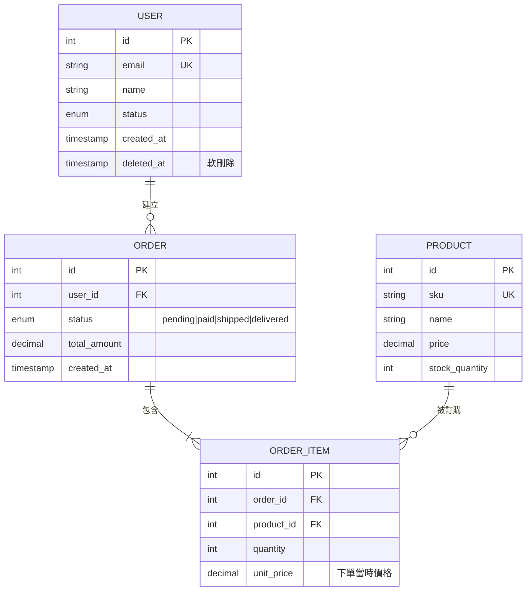
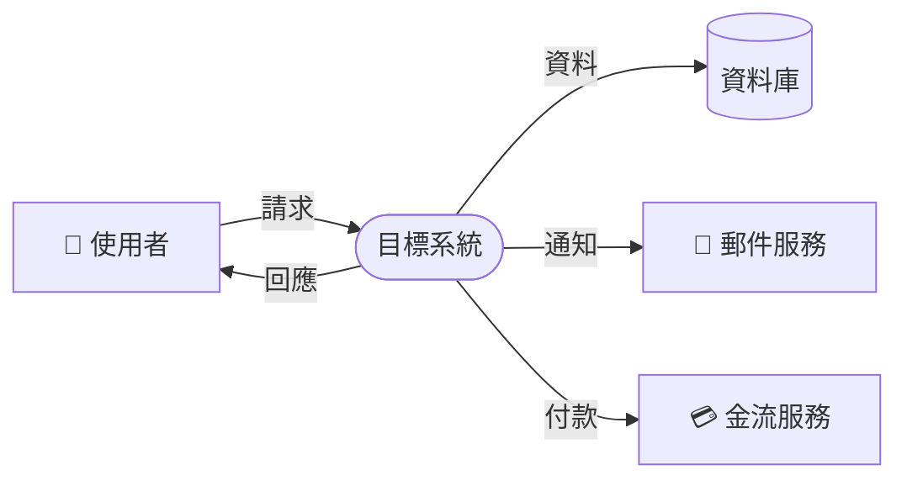
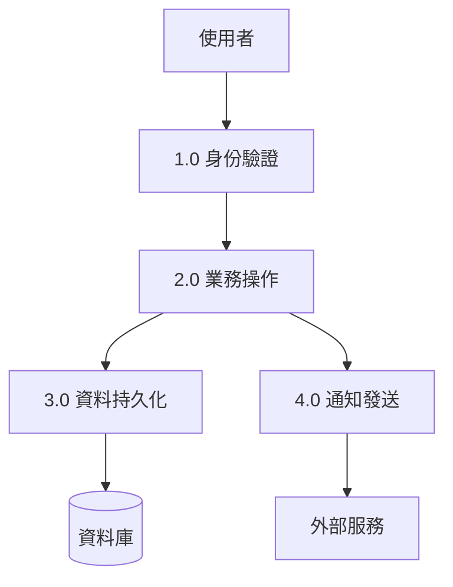

# ERD 繪製指南（逆向工程版）

## Mermaid ERD 語法快速參考

## 關聯符號說明

| 符號 | 含義 |
|-----|-----|
| `||--||` | 一對一（強制） |
| `||--o|` | 一對一（選填） |
| `||--|{` | 一對多（至少一個） |
| `||--o{` | 一對多（零或多個） |
| `}|--|{` | 多對多（強制兩端） |
| `}o--o{` | 多對多（選填兩端） |

## 逆向工程 ERD 步驟

### Step 1：識別核心實體
從資料表名稱中，先識別「業務核心表」（通常是名詞，如 users, orders, products）
排除輔助表（如 *_logs, *_audit, *_history, *_cache）

### Step 2：建立關聯
1. 找出所有 Foreign Key → 直接對應關聯
2. 找出橋接表（兩個外鍵的表）→ 多對多關聯
3. 找出 parent_id 自我參照 → 樹狀/階層結構

### Step 3：標注業務含義
在每個關聯線上加入動詞，說明業務語義：
- USER ||--o{ ORDER : "下" （使用者下訂單）
- ORDER ||--|{ ORDER_ITEM : "包含"
- PRODUCT }o--o{ TAG : "被標記"

### Step 4：識別關鍵欄位
不需列出所有欄位，只標注：
- PK（主鍵）
- FK（外鍵）  
- UK（唯一鍵，揭示業務唯一性規則）
- 重要的 enum 欄位（揭示狀態機）
- 帶有業務含義的特殊欄位（加註釋說明）

## 資料流程圖 (DFD) 範例

### Level 0（Context Diagram）

### Level 1（主要流程分解）

