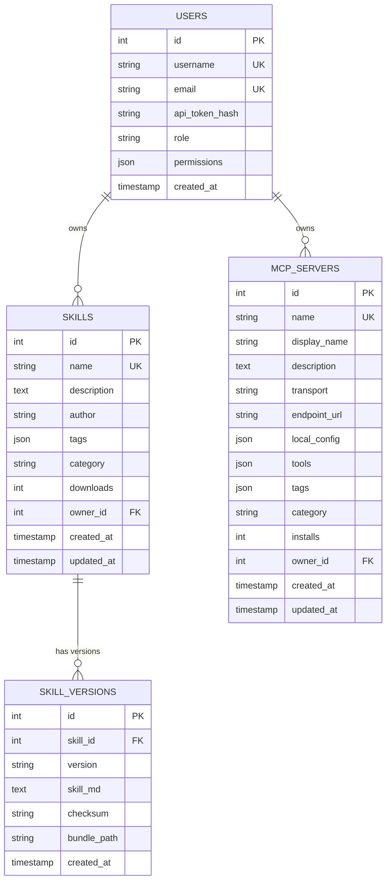

# Table Schema 文件模板

> 使用說明：從 ORM 模型、Migration 文件、DDL 腳本逆向推導欄位語義與業務規則。
> 標記系統：`[事實]` 有程式碼佐證｜`[推測]` 合理推論｜`[待確認]` 需開發者確認

---

## 執行摘要

> [一段話描述資料庫整體設計：資料庫類型、核心資料模型數量、主要業務領域。]
>
> 範例：「本系統使用 SQLite（WAL 模式），共 N 張核心資料表，涵蓋用戶管理、技能發布、版本追蹤三個核心業務領域。」

---

## 1. 資料庫概覽

| 項目 | 值 | 說明 |
|------|-----|------|
| 資料庫類型 | SQLite / PostgreSQL / MySQL | [事實/推測] |
| 版本 | - | [事實/推測] |
| 字元集 | UTF-8 | [事實/推測] |
| 排序規則 | - | [事實/推測] |
| 連線模式 | WAL / 一般 | [推測] |
| ORM 框架 | SQLAlchemy / Prisma / TypeORM 等 | [事實/推測] |
| Migration 工具 | Flask-Migrate / Alembic / 其他 | [推測] |
| 備份策略 | [待確認] | |

---

## 2. 命名規範

| 類型 | 規範 | 範例 |
|------|------|------|
| 資料表名稱 | snake_case 複數 | `skill_versions`、`mcp_servers` |
| 欄位名稱 | snake_case | `created_at`、`owner_id` |
| 主鍵 | `id`（自增整數）或 UUID | `id`、`uuid` |
| 外鍵 | `{referenced_table_singular}_id` | `skill_id`、`user_id` |
| 索引 | `ix_{table}_{column}` | `ix_skills_name` |
| 唯一約束 | `uq_{table}_{column}` | `uq_users_username` |
| 軟刪除 | `deleted_at TIMESTAMP NULL` | 有值表示已刪除 |
| 時間戳 | `created_at`、`updated_at` | 通常自動填充 |

---

## 3. 資料表目錄

| 資料表 | 說明 | 主鍵 | 關聯表 |
|--------|------|------|--------|
| `skills` | 技能主表，一個技能名稱對應多個版本 | `id` | `skill_versions`, `users` |
| `skill_versions` | 技能版本記錄，每次發布新增一筆 | `id` | `skills` |
| `users` | 使用者帳號，包含角色與細粒度權限 | `id` | `skills` |
| `mcp_servers` | MCP Server 登錄表，含連線設定與工具清單 | `id` | `users`（[推測]） |

---

## 4. 資料表詳細定義

### 4.1 `skills` — 技能主表

**用途：** 儲存每個技能的元數據（名稱唯一），版本內容存於 `skill_versions`。

| 欄位名稱 | 型別 | 必填 | 預設值 | 業務說明 |
|---------|------|------|--------|---------|
| `id` | INTEGER | ✅ | AUTO | 主鍵，自動遞增 |
| `name` | VARCHAR(200) | ✅ | - | 技能唯一識別名（slug），全域唯一 |
| `description` | TEXT | ✅ | - | 技能說明，用於搜尋與展示 |
| `author` | VARCHAR(100) | ✅ | - | 作者名稱（不一定等於 owner） |
| `tags` | JSON | ❌ | `[]` | 標籤陣列，用於過濾（如 `["python","coding"]`） |
| `category` | VARCHAR(50) | ❌ | NULL | 分類 ID（對應 admin.CATEGORIES），可為 NULL |
| `downloads` | INTEGER | ✅ | `0` | 累計下載次數（[事實] 每次 `/download` +1） |
| `owner_id` | INTEGER FK | ❌ | NULL | 關聯 `users.id`，NULL 表示無主（[推測]） |
| `created_at` | TIMESTAMP | ✅ | `NOW()` | 首次發布時間 |
| `updated_at` | TIMESTAMP | ✅ | `NOW()` | 最後更新時間（自動更新） |

**主鍵：** `id`
**外鍵：** `owner_id → users.id` (ON DELETE SET NULL)
**索引：**

| 索引名稱 | 欄位 | 類型 | 用途 |
|---------|------|------|------|
| `uq_skills_name` | `name` | UNIQUE | 防止同名技能 |
| `ix_skills_category` | `category` | INDEX | 分類過濾查詢 |
| `ix_skills_downloads` | `downloads` | INDEX | 排行榜排序 |

**約束：**
- `name` 不得包含空白或特殊字元（由應用層驗證）

**範例資料：**

| id | name | author | category | downloads |
|----|------|--------|----------|-----------|
| 1 | pdf-skill | alice | writing | 120 |
| 2 | github-helper | bob | coding | 45 |

---

### 4.2 `skill_versions` — 技能版本表

**用途：** 每次執行 `push` 指令時新增一筆記錄，保留完整版本歷史。

| 欄位名稱 | 型別 | 必填 | 預設值 | 業務說明 |
|---------|------|------|--------|---------|
| `id` | INTEGER | ✅ | AUTO | 主鍵 |
| `skill_id` | INTEGER FK | ✅ | - | 關聯 `skills.id` |
| `version` | VARCHAR(50) | ✅ | - | 版本號（semver，如 `1.0.0`） |
| `skill_md` | TEXT | ✅ | - | SKILL.md 完整內容 |
| `checksum` | VARCHAR(64) | ✅ | - | SHA-256 hex digest，驗證完整性 |
| `bundle_path` | VARCHAR(500) | ❌ | NULL | 附加 .tar.gz 檔案的伺服器路徑（可為 NULL） |
| `created_at` | TIMESTAMP | ✅ | `NOW()` | 版本發布時間 |

**主鍵：** `id`
**外鍵：** `skill_id → skills.id` (ON DELETE CASCADE)
**索引：**

| 索引名稱 | 欄位 | 類型 | 用途 |
|---------|------|------|------|
| `uq_skill_versions_skill_version` | `(skill_id, version)` | UNIQUE | 防止同一技能有重複版本 |
| `ix_skill_versions_skill_id` | `skill_id` | INDEX | 依技能查詢版本列表 |

**範例資料：**

| id | skill_id | version | checksum |
|----|---------|---------|----------|
| 1 | 1 | 1.0.0 | a3f2...b1 |
| 2 | 1 | 1.0.1 | c5d8...e2 |

---

### 4.3 `users` — 使用者帳號表

**用途：** 管理所有使用者的認證資訊、角色與細粒度權限。

| 欄位名稱 | 型別 | 必填 | 預設值 | 業務說明 |
|---------|------|------|--------|---------|
| `id` | INTEGER | ✅ | AUTO | 主鍵 |
| `username` | VARCHAR(100) | ✅ | - | 使用者名稱，全域唯一 |
| `email` | VARCHAR(200) | ❌ | NULL | 電子郵件，唯一（允許 NULL）|
| `api_token_hash` | VARCHAR(255) | ❌ | NULL | API Token 的 SHA-256 Hash（明文不存入DB） |
| `role` | VARCHAR(50) | ✅ | `user` | 角色：`admin`、`maintainer`、`user` |
| `permissions` | JSON | ✅ | `[]` | 細粒度權限清單（如 `["skill:create","mcp:create"]`） |
| `created_at` | TIMESTAMP | ✅ | `NOW()` | 帳號建立時間 |

**主鍵：** `id`
**索引：**

| 索引名稱 | 欄位 | 類型 | 用途 |
|---------|------|------|------|
| `uq_users_username` | `username` | UNIQUE | 防止用戶名重複 |
| `uq_users_email` | `email` | UNIQUE | 防止 Email 重複（允許 NULL） |
| `ix_users_api_token_hash` | `api_token_hash` | INDEX | 每次 API 請求按 Hash 查詢用戶 |

**注意事項：**
- `api_token_hash` 由 SHA-256 計算得出，明文 Token 僅在 `/api/auth/login` 時回傳一次
- `admin` 角色的用戶可繞過所有 `permissions` 檢查（程式層面實現）
- [推測] 密碼欄位不存在；系統以 Token 為主要認證手段

**範例資料：**

| id | username | role | permissions |
|----|---------|------|-------------|
| 1 | admin | admin | [] |
| 2 | alice | user | ["skill:create"] |

---

### 4.4 `mcp_servers` — MCP Server 登錄表

**用途：** 儲存已發布的 MCP Server 的連線設定、工具清單與統計資訊。

| 欄位名稱 | 型別 | 必填 | 預設值 | 業務說明 |
|---------|------|------|--------|---------|
| `id` | INTEGER | ✅ | AUTO | 主鍵 |
| `name` | VARCHAR(200) | ✅ | - | MCP Server 唯一識別名（slug） |
| `display_name` | VARCHAR(200) | ❌ | NULL | 顯示名稱（用於 UI 展示） |
| `description` | TEXT | ❌ | NULL | 說明文字 |
| `transport` | VARCHAR(20) | ✅ | - | 傳輸協定：`sse`、`stdio`、`http` |
| `endpoint_url` | VARCHAR(500) | ❌ | NULL | SSE 傳輸時的遠端 URL |
| `local_config` | JSON | ❌ | `[]` | stdio 傳輸時的啟動設定陣列（`env_values` 已去除） |
| `tools` | JSON | ❌ | `[]` | 工具清單（由後台非同步內省填充） |
| `tags` | JSON | ❌ | `[]` | 標籤陣列 |
| `category` | VARCHAR(50) | ❌ | NULL | 分類 ID |
| `installs` | INTEGER | ✅ | `0` | 累計安裝次數 |
| `owner_id` | INTEGER FK | ❌ | NULL | 關聯 `users.id`（[推測]） |
| `created_at` | TIMESTAMP | ✅ | `NOW()` | 首次發布時間 |
| `updated_at` | TIMESTAMP | ✅ | `NOW()` | 最後更新時間 |

**主鍵：** `id`
**外鍵：** `owner_id → users.id` (ON DELETE SET NULL)（[推測]）
**索引：**

| 索引名稱 | 欄位 | 類型 | 用途 |
|---------|------|------|------|
| `uq_mcp_servers_name` | `name` | UNIQUE | 防止同名 MCP Server |
| `ix_mcp_servers_transport` | `transport` | INDEX | 按傳輸類型過濾 |
| `ix_mcp_servers_category` | `category` | INDEX | 分類過濾 |

**JSON 欄位範例（`local_config`）：**

```json
[
  {
    "type": "node",
    "command": "npx",
    "package": "@org/mcp-server",
    "env": ["API_KEY", "SECRET_TOKEN"]
  }
]
```

> 注意：`env_values`（實際鍵值）在寫入資料庫前已被移除，僅用於工具內省流程。

**範例資料：**

| id | name | transport | installs |
|----|------|-----------|---------|
| 1 | github-mcp | stdio | 30 |
| 2 | search-mcp | sse | 12 |

---

## 5. ERD 實體關係圖



> [推測] `USERS → MCP_SERVERS` 關聯依程式碼推測存在，但資料庫層可能未設外鍵約束。

---

## 6. 隱含業務規則（從 Schema 推導）

| Schema 特徵 | 推導出的業務規則 |
|------------|----------------|
| `skills.downloads` 計數器 | 系統追蹤下載量；可能用於排行榜或推薦算法 |
| `skill_versions.checksum` | 完整性驗證；確保下載到的文件未被竄改 |
| `users.permissions` JSON 陣列 | ABAC 設計；支援細粒度授權，不受角色限制 |
| `users.api_token_hash` | 安全設計；Token 明文不落地 |
| `mcp_servers.local_config` JSON | 多種執行環境（node/python/docker）從同一記錄服務 |
| `mcp_servers.tools` JSON | 工具清單非同步填充；允許發布時工具清單暫時為空 |
| `skill_versions` 獨立資料表 | 版本不可變；支援版本回滾與稽核 |

---

## 7. 已知技術債

| # | 問題 | 影響 | 建議解法 |
|---|------|------|---------|
| 1 | `tags` 使用 JSON 欄位而非獨立 Tag 資料表 | 標籤查詢使用 LIKE `%"tag"%`，效率低 | 建立 `tags` 正規化資料表 |
| 2 | `permissions` 使用 JSON 欄位 | 無法用 SQL 約束確保權限字串合法 | 建立 `permissions` 正規化資料表 |
| 3 | `mcp_servers.tools` 使用 JSON 欄位 | 無法對工具進行索引搜尋 | 視搜尋需求決定是否正規化 |
| 4 | SQLite 在高並發時有寫鎖瓶頸 | 大量並發寫入時效能下降 | WAL 模式可緩解；若擴展則遷移至 PostgreSQL |

---

## 8. 待確認問題清單

1. `[待確認]` `users.api_token_hash` 是否有過期機制？Token 可否主動撤銷？
2. `[待確認]` `skill_versions` 刪除策略為何？是否保留所有歷史版本？
3. `[待確認]` `mcp_servers.owner_id` 在資料庫層是否有外鍵約束？
4. `[待確認]` `skills.downloads` 是否有防刷機制（如 IP 去重）？
5. `[待確認]` 是否有針對 SQLite WAL 檔案的備份策略？
