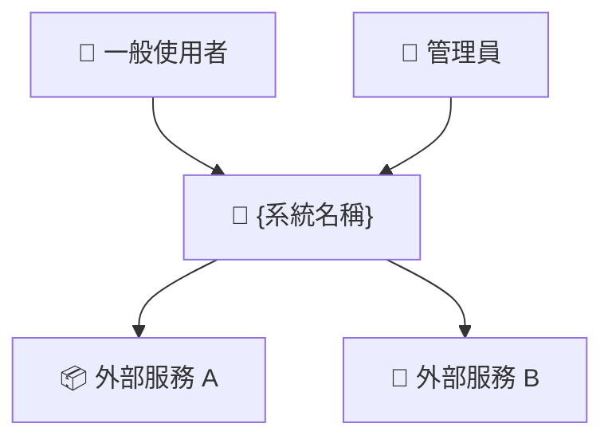
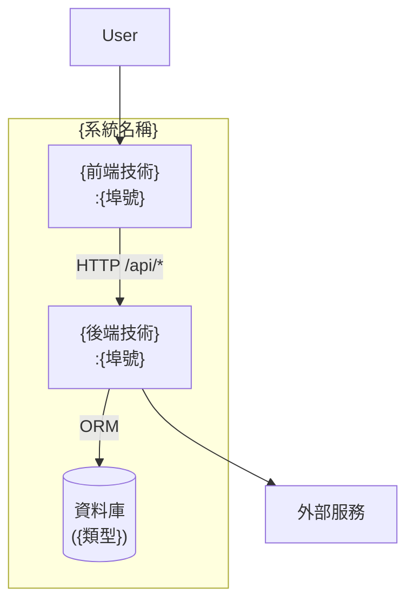
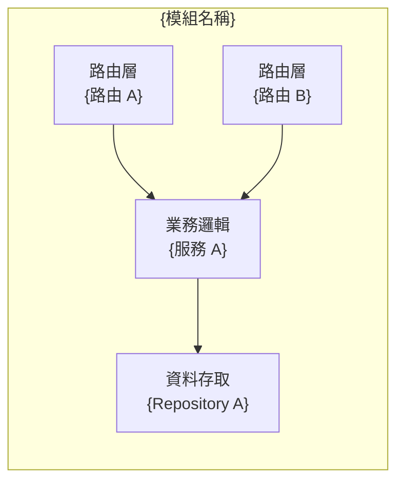
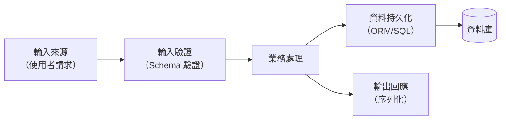
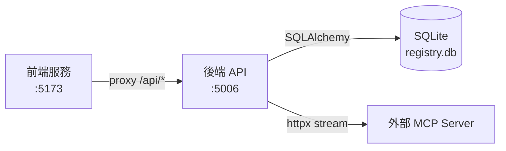

# SDD（軟體設計文件）模板

> 本模板適用於從現有程式碼逆向推導的 SDD。
> 使用 [事實] / [推測] / [待確認] 標記所有內容的可信度。

---

# {系統名稱} 軟體設計文件 (SDD)

**文件版本：** v1.0
**分析日期：** {日期}
**系統版本：** {從 package.json / pyproject.toml / git tag 推斷}

## 執行摘要

{一段話說明這個系統的核心職責、主要技術棧、以及這份 SDD 的分析來源（程式碼 / Schema / API 文件）}

---

## 1. 系統概覽

### 1.1 系統邊界

**系統做什麼：**
- {功能點 1}
- {功能點 2}

**系統不做什麼（明確排除）：**
- {排除項 1} [推測/事實]

### 1.2 技術棧總覽

| 層次 | 技術 | 版本 | 備註 |
|------|------|------|------|
| 前端 | {Vue/React/...} | {版本} | [事實/推測] |
| 後端 | {Flask/Express/...} | {版本} | [事實] |
| 資料庫 | {SQLite/PostgreSQL/...} | {版本} | [事實] |
| 容器化 | {Docker/K8s/...} | {版本} | [事實/無] |

---

## 2. 架構設計

### 2.1 分層架構說明

{描述系統的分層方式，例如：展示層 → API 層 → 業務邏輯層 → 資料層}

每層的職責：
- **展示層**：{職責說明}
- **API 層**：{職責說明}
- **業務邏輯層**：{職責說明}
- **資料層**：{職責說明}

**重要原則**：[推測/事實] {例如：跨層依賴方向只允許向下，禁止資料層直接呼叫業務層}

### 2.2 系統架構圖（C4 Model）

#### Context 圖（誰使用這個系統、與哪些外部系統互動）



#### Container 圖（系統內部的主要容器/服務）



#### Component 圖（{最複雜模組} 的內部元件）



### 2.3 模組責任劃分

| 模組/套件 | 主要職責 | 可以依賴 | 禁止依賴 |
|---------|---------|---------|---------|
| {模組 A} | {職責} | {允許的依賴} | {禁止的依賴} |
| {模組 B} | {職責} | {允許的依賴} | {禁止的依賴} |

---

## 3. 元件設計

### 3.1 {元件名稱 1}

**職責：** {這個元件負責什麼}

**主要介面（對外暴露的方法/API）：**
```
{函式名稱}({參數}) → {回傳型別}
說明：{這個介面做什麼}
```

**依賴：**
- 向上依賴（被誰呼叫）：{模組名稱}
- 向下依賴（呼叫誰）：{模組名稱}

**[推測] 設計決策：** {為何這樣設計}

---

### 3.2 {元件名稱 2}

（重複上述格式）

---

## 4. 資料設計

### 4.1 核心資料流向



### 4.2 關鍵資料轉換

| 轉換點 | 輸入格式 | 輸出格式 | 轉換邏輯 |
|--------|---------|---------|---------|
| {轉換點 1} | {格式} | {格式} | {邏輯說明} |

### 4.3 快取策略

{[事實/推測/無] 描述是否有快取，快取什麼、快取在哪裡、失效策略}

---

## 5. 安全設計

### 5.1 認證機制

**認證方式：** [事實] {例如：Bearer Token / JWT / Session}

**Token 生命週期：**
- 產生方式：{說明}
- 儲存方式：{說明，例如：hash 後存 DB}
- 失效條件：{說明}

### 5.2 授權機制

**授權模型：** [事實/推測] {RBAC / ABAC / 混合}

| 角色 | 可執行的操作 | 限制條件 |
|------|------------|---------|
| admin | 全部操作 | 無 |
| {角色 2} | {操作清單} | {限制} |
| {角色 3} | {操作清單} | {限制} |

### 5.3 敏感資料處理

| 資料類型 | 處理方式 | [事實/推測] |
|---------|---------|------------|
| API Token | SHA-256 hash 後存 DB，原始值不儲存 | [事實] |
| 密碼 | {bcrypt / argon2 / ...} | [事實/推測] |
| 第三方憑證 | {處理方式} | [事實] |

### 5.4 已識別的攻擊面

| 攻擊類型 | 風險點 | 現有防護 | 建議補強 |
|---------|-------|---------|---------|
| CSRF | {說明} | {防護} | {建議} |
| SQL Injection | {說明} | ORM 參數化查詢 | [事實] |
| XSS | {說明} | {防護} | {建議} |

---

## 6. 錯誤處理策略

### 6.1 錯誤碼設計

| HTTP 狀態碼 | 含義 | 觸發場景 |
|------------|------|---------|
| 400 | 請求格式錯誤 | 輸入驗證失敗 |
| 401 | 未認證 | 缺少或無效的 Token |
| 403 | 未授權 | 無對應操作權限 |
| 404 | 資源不存在 | 查詢的資料不在 DB |
| 409 | 資源衝突 | 唯一約束違反（如版本重複） |
| 500 | 伺服器錯誤 | 未預期的例外 |

### 6.2 錯誤回應格式

```json
{
  "error": {
    "code": "RESOURCE_NOT_FOUND",
    "message": "The requested skill 'web-search' does not exist",
    "details": {}
  }
}
```

### 6.3 重試與降級策略

{[推測/事實] 描述系統對外部服務失敗的處理方式，例如：MCP 內省失敗時靜默記錄 log 而不阻塞主流程}

---

## 7. 效能考量

### 7.1 已識別的效能瓶頸

| 瓶頸點 | 原因 | 影響 | 建議優化 |
|-------|------|------|---------|
| {瓶頸 1} | {原因} | {影響} | {建議} |

### 7.2 資料庫查詢優化

{描述現有索引策略、N+1 查詢風險點、分頁實作方式}

### 7.3 [推測] 擴展性考量

{描述現有架構在什麼規模開始遇到瓶頸，以及可能的擴展方向}

---

## 8. 部署架構

### 8.1 環境配置

| 環境 | 說明 | 啟動方式 |
|------|------|---------|
| 開發 | {說明} | {指令} |
| 生產 | {說明} | {指令} |

### 8.2 服務依賴關係



### 8.3 環境變數清單

| 變數名稱 | 用途 | 預設值 | 必填 |
|---------|------|-------|------|
| {VAR_NAME} | {用途} | {預設值} | 是/否 |

---

## 9. 已知技術債

| 編號 | 描述 | 影響範圍 | 優先級 | 建議解法 |
|------|------|---------|-------|---------|
| TD-001 | {技術債描述} | {影響} | 高/中/低 | {建議} |

---

## 待確認問題

1. [待確認] {問題 1}
2. [待確認] {問題 2}
